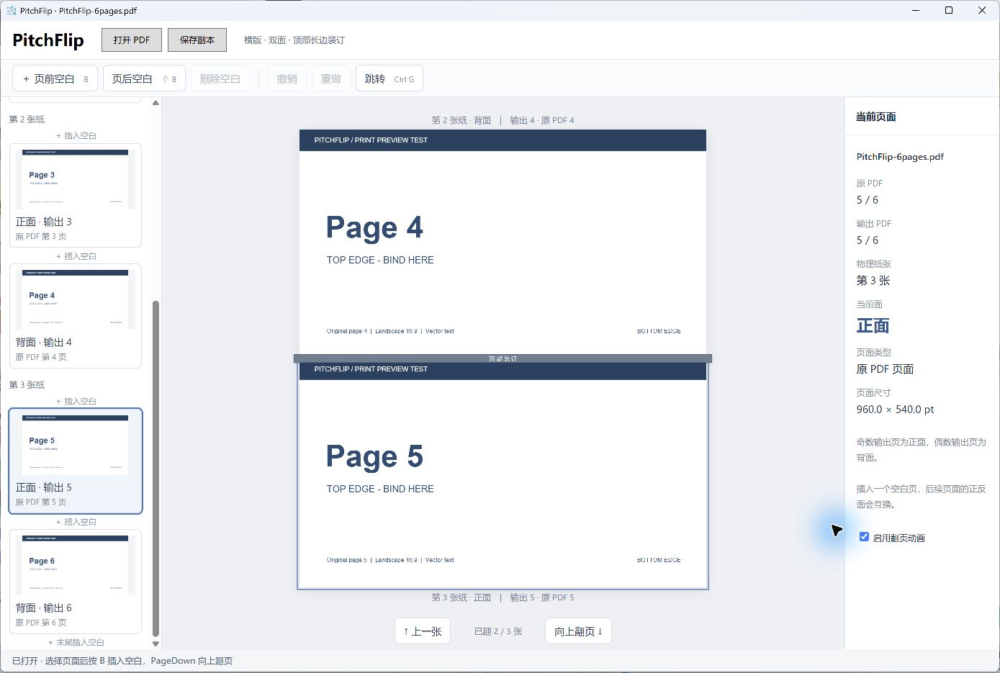
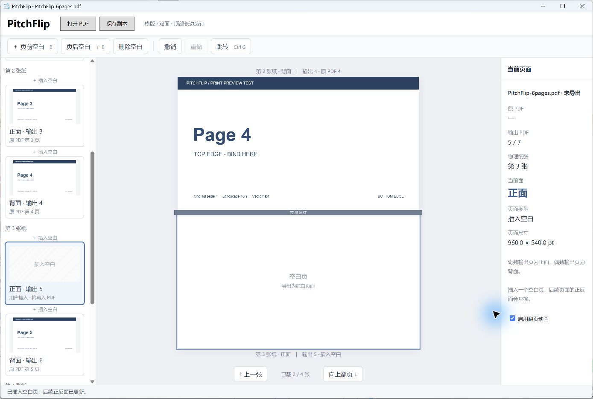

<p align="center">
  
</p>

<h1 align="center">PitchFlip</h1>
<p align="center"><strong>横版双面装订预检工具</strong><br>打印之前，先翻一遍。</p>
<p align="center">Windows 桌面应用 · 本地处理 · 顶部装订预览 · 手动插入空白</p>

PitchFlip 用来检查横版 PDF 的双面打印效果。像翻一本沿顶部装订的材料一样查看正反面，在需要的位置插入空白，再导出一份新的 PDF。

例如：目录原来在输出第 8 页，是第 4 张纸的背面。在它前面插入空白后，目录变成输出第 9 页，落在第 5 张纸的正面。

## 看见打印后的正反面



上方显示刚翻过去那张纸的背面，下方显示下一张纸的正面。右侧同时标明**原 PDF 页码、输出页码、物理纸张和正反面**。截图使用仓库自带的合成测试 PDF。

## 可以做什么

- **实体翻页预览**：顶部横轴 3D 翻转，支持按钮、键盘和鼠标拖动。
- **快捷插入空白**：页面间按钮、右键菜单、页前／页后快捷键。
- **实时重新编排**：插入空白后，后续页码和正反面立即更新。
- **同步定位**：左侧按物理纸张分组，跟随当前页高亮、滚动。
- **撤销与重做**：可删除用户插入的空白，不能删除原始 PDF 页面。
- **保存副本**：复制原始 PDF 页面内容，不将原页重新栅格化，也不覆盖原文件。



界面中的“空白页”文字只是提示，导出时对应页面为纯白。奇数页文件最后一张纸背面的**物理补位空白**仅用于预览，不自动添加到导出的 PDF。

## 开始使用

### 便携版

1. 将便携版 ZIP **完整解压**，不要只取出其中的 EXE。
2. 运行解压目录中的 `PitchFlip.exe`。
3. 点击“打开 PDF”，或将 PDF 拖进窗口。
4. 翻页检查，在需要的位置插入空白，点击“保存副本”。

运行要求：**Windows 10/11 x64 + Microsoft Edge WebView2 Runtime**。自包含发布包内附 .NET 运行时，不需要另装 .NET。当前为早期 MVP，便携包暂无安装器和数字签名。

### 从源码运行

安装 .NET 10 SDK，在仓库根目录执行：

```powershell
./build.ps1
```

然后双击根目录的 `启动 PitchFlip.cmd`，或运行 `dist/PitchFlip/PitchFlip.exe`。首次还原构建依赖需要网络；PDF.js 资源已随源码保存，普通构建不需要 npm。

可以用 `samples/PitchFlip-6pages.pdf` 试用：在原第 5 页前插入一个空白后，输出应为 7 页、4 张物理纸。

## 快捷键

| 快捷键 | 操作 |
|---|---|
| ↓ / PageDown / Space | 向上翻下一张纸 |
| ↑ / PageUp | 翻回上一张纸 |
| B / Shift+B | 当前页前／后插入空白 |
| Delete | 删除当前插入的空白 |
| Ctrl+Z / Ctrl+Y | 撤销／重做 |
| Ctrl+G | 按原始页、输出页或纸张编号跳转 |
| Ctrl+O / Ctrl+S | 打开 PDF／保存副本 |

先点击预览区或翻页按钮即可使用预览快捷键。页码输入框中的上下键仍用于调整数值。

## 本地处理与文件保护

PDF 在本机处理，不上传、不调用云 API、不集成 AI，也不记录正文或应用遥测。PDF.js、字体及解码资源本地打包，没有 CDN 依赖。

原文件只读加载；编辑发生在虚拟页面序列中，只有“保存副本”才写出新的 PDF。导出禁止使用源文件路径。缩略图保存在内存中，WebView2 的独立临时配置目录在正常退出时清理；强制终止可能留下浏览器配置缓存。

## 当前边界

- 适用于横版、双面、顶部长边装订；不控制打印机，也不模拟打印机缩放和裁切。正式批量打印前，建议先试打少量页面核对驱动的翻转方向。
- 不自动判断哪里需要空白，不编辑 PDF 正文，不做 OCR。
- 暂不保存 `.pitchflip` 工程，不支持输入密码打开加密 PDF。
- 副本导出不保证保留书签、文档级表单、签名、复杂跨页链接或 PDF/A 合规。
- 已验证合成样本及 200 页文件打开；尚未全面覆盖 100 MB 真实文件、不同 DPI 和打印机。

## 开发与反馈

项目代码采用 [MIT 许可证](LICENSE)。第三方组件保留各自的许可证。

基于 **C# / .NET 10 / WPF / WebView2 / PDF.js / PDFsharp**。

- [开发与测试](docs/DEVELOPMENT.md)
- [验证记录](VALIDATION.md)
- [版本记录](CHANGELOG.md)
- [反馈与贡献](CONTRIBUTING.md)
- [第三方组件及许可证](THIRD_PARTY_NOTICES.md)

反馈问题时，请提供复现步骤和脱敏后的最小样本，勿附上客户材料、保密 PDF 或包含私人路径的截图。
